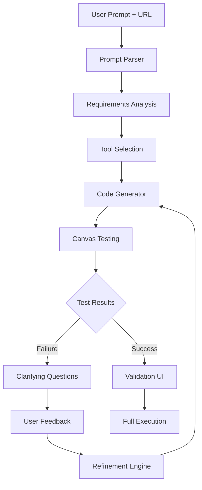

# Prompt-Driven Scraper Generator

A sophisticated web scraping system that converts natural language prompts into executable scraping scripts using LLM-powered code generation, featuring a multi-job dashboard and flexible data schemas.

## 🎯 Overview

This system transforms simple prompts into fully functional web scrapers:

**Input**: Natural language prompt + target URL  
**Output**: Dynamically generated scraping script + structured data

### Key Features

- **🧠 LLM Code Generation**: Converts prompts to executable TypeScript/Playwright/Stagehand code
- **🔄 Iterative Refinement**: Tests scripts on samples, asks clarifying questions, refines approach  
- **📊 Flexible Schemas**: Each job defines its own output structure dynamically
- **🎯 Multi-Tool Support**: Automatically chooses between Stagehand (LLM-driven), Playwright (traditional), or hybrid approaches
- **💼 Job Management**: Multi-job dashboard with history, progress tracking, and result visualization
- **🔍 Canvas Testing**: Tests generated scripts on small samples before full execution
- **💬 Clarifying Questions**: Intelligent error recovery with targeted user feedback

## 🚀 Quick Start

### Prerequisites

- Node.js 18+
- Anthropic Claude API key
- Chrome/Chromium browser
- Supabase database

### Installation

```bash
# Clone the repository
git clone <repository-url>
cd scraper

# Install dependencies
npm install

# Set up environment variables
cp env.example .env
# Edit .env with your API keys

# Set up the web application
cd webapp
npm install
cp env.example .env.local
# Configure Supabase and API keys

# Run database migrations
npx supabase migrate up
```

### Basic Usage

#### Web Interface (Recommended)

```bash
cd webapp
npm run dev
```

Navigate to `http://localhost:3000` and use the Generate & Run wizard:

1. Enter a natural language prompt
2. Provide the target URL  
3. Review generated code
4. Validate sample results
5. Execute at scale

#### Programmatic Usage

```typescript
import { createOrchestrator } from './src/codegen/orchestrator';

const orchestrator = createOrchestrator();

// Generate a scraper from prompt
const job = await orchestrator.executeCodegenPipeline({
  url: 'https://example.com',
  prompt: 'Scrape all product names and prices from this e-commerce site'
});

// Execute the generated script
const result = await orchestrator.executeScript(job);
```

## 📖 How It Works

### 1. LLM Code Generation Pipeline

The system follows a sophisticated **Prompt → Code → Test → Refine** pipeline:



### 2. Intelligent Tool Selection

The system automatically chooses the best scraping approach:

- **Stagehand (LLM-powered)**: For complex navigation, dynamic content, anti-bot protection
- **Playwright (Traditional)**: For high-performance bulk extraction with known selectors  
- **Hybrid**: Combines both - Stagehand for navigation, Playwright for data extraction

### 3. Test Extraction Approach

Before running expensive full-scale scrapes:

1. **Micro-test**: Execute on 1-5 sample items
2. **Validation**: Show results to user for approval
3. **Clarification**: If test fails, ask intelligent questions
4. **Refinement**: Generate improved code based on feedback

## 🎯 Example Prompts

### E-commerce Scraping
```
Prompt: "Get all laptop products with names, prices, ratings, and availability from pages 1-5"
URL: https://example-electronics.com/laptops
```

### Business Directory
```  
Prompt: "Scrape all A-rated medical billing companies including name, phone, address, and contact person"
URL: https://www.bbb.org/search?find_text=Medical+Billing&filter_ratings=A
```

### Real Estate
```
Prompt: "Extract property listings with price, bedrooms, bathrooms, square footage, and photos from the first 10 pages"
URL: https://example-realty.com/listings
```

## 🏗️ Architecture

### Core Components

#### A. LLM Code-Gen Service (`src/codegen/`)

- **Prompt Parser**: Analyzes prompts to extract requirements, scope, and output schema
- **Code Generator**: Creates executable TypeScript using Claude Sonnet 4
- **Refinement Engine**: Iteratively improves scripts based on test results and user feedback

#### B. Execution Module  

- **Sandbox Execution**: Safely runs generated scripts in controlled environment
- **Multi-tool Support**: Seamlessly switches between Stagehand and Playwright
- **Progress Streaming**: Real-time execution logs and progress updates

#### C. Web Application (`webapp/`)

- **Generate & Run Wizard**: Step-by-step script creation and validation
- **Multi-job Dashboard**: History, status tracking, and result visualization  
- **Flexible Table Renderer**: Dynamically displays results based on each job's schema

### Database Schema

#### Flexible Data Architecture

```sql
-- Generated scripts and metadata
CREATE TABLE scraper_scripts (
    id UUID PRIMARY KEY,
    title TEXT NOT NULL,
    prompt TEXT NOT NULL,
    generated_code TEXT NOT NULL,
    requirements JSONB NOT NULL,
    tool_type TEXT CHECK (tool_type IN ('stagehand', 'playwright', 'hybrid')),
    output_schema JSONB NOT NULL,
    dependencies TEXT[]
);

-- Job execution tracking  
CREATE TABLE scraping_jobs (
    id UUID PRIMARY KEY,
    script_id UUID REFERENCES scraper_scripts(id),
    status TEXT,
    total_items INTEGER,
    execution_time INTEGER
);

-- Flexible result storage
CREATE TABLE scraped_data (
    id UUID PRIMARY KEY,
    scraping_job_id UUID REFERENCES scraping_jobs(id),
    data JSONB NOT NULL  -- Dynamic schema per job
);
```

## 🎛️ Configuration

### Environment Variables

```bash
# Required: LLM Provider
ANTHROPIC_API_KEY=your_anthropic_api_key

# Database
SUPABASE_URL=your_supabase_url
SUPABASE_ANON_KEY=your_supabase_anon_key

# Optional: Production browser execution
BROWSERBASE_API_KEY=your_browserbase_api_key
BROWSERBASE_PROJECT_ID=your_browserbase_project_id
```

### Orchestrator Configuration

```typescript
const orchestrator = createOrchestrator({
  maxRefinementAttempts: 2,  // How many times to refine failed scripts
  testTimeout: 30000,        // Canvas test timeout (30s)
  executionTimeout: 300000   // Full execution timeout (5min)
});
```

## 🔄 API Endpoints

### Generate Script
```
POST /api/generate
Body: { prompt: string, url: string, clarifications?: object }
Response: { success: boolean, jobId?: string, needsClarification?: boolean }
```

### Clarify Requirements  
```
POST /api/generate/clarify
Body: { scriptId: string, clarifications: object, originalPrompt: string, url: string }
Response: { success: boolean, jobId?: string, testResult?: object }
```

### Execute Script
```
POST /api/scrape  
Body: { jobId: string, executeGenerated: true }
Response: { success: boolean, result?: ExecutionResult }
```

### Get Results
```
GET /api/jobs/[id]/results
Response: { data: any[], totalFound: number, outputSchema: object }
```

## 📊 Output Formats

Each job defines its own schema dynamically. Example outputs:

### E-commerce Products
```json
{
  "data": [
    {
      "product_name": "MacBook Pro 16\"",
      "price": "$2,399",
      "rating": 4.8,
      "availability": "In Stock",
      "sku": "MBP16-2023"
    }
  ],
  "totalFound": 247,
  "outputSchema": [
    { "name": "product_name", "type": "string", "required": true },
    { "name": "price", "type": "currency", "required": true },
    { "name": "rating", "type": "number", "required": false }
  ]
}
```

### Business Directory
```json
{
  "data": [
    {
      "company_name": "Elite Medical Billing Services",
      "phone": "+1-555-0123",
      "address": "123 Healthcare Blvd, Suite 200",
      "contact_person": "Sarah Johnson",
      "accreditation": "A+"
    }
  ],
  "totalFound": 89
}
```

## 🚨 Error Handling & Recovery

### Intelligent Clarification System

When scripts fail, the system generates targeted questions:

```typescript
// Example clarifying questions
{
  "questions": [
    {
      "question": "Does this site use infinite scroll or pagination buttons?",
      "type": "multiple_choice",
      "options": ["Infinite scroll", "Pagination buttons", "Load more button"]
    },
    {
      "question": "Should I wait for any specific content to load (e.g., prices, images)?",
      "type": "text"
    }
  ],
  "reasoning": "The script failed to find expected elements, likely due to dynamic content loading."
}
```

### Automatic Refinement

The refinement engine:
1. Analyzes test failures and error patterns
2. Generates improved code addressing specific issues  
3. Adds better error handling and robustness
4. Incorporates user feedback and clarifications

## 🔮 Advanced Features

### Parallel Execution Architecture

For large datasets, the system automatically generates parallel worker code:

```typescript
// Generated parallel worker structure
1. URL Collection Phase: Single worker collects all URLs
2. Parallel Processing: Multiple workers process items concurrently  
3. Result Aggregation: Combine results from all workers
4. Graceful Error Handling: Partial results on worker failures
```

### Canvas Testing Strategy

- **Micro-tests**: Run on 1-5 samples before full execution
- **User Validation**: Always show sample results for approval
- **Smart Sampling**: Test representative examples from different pages
- **Failure Analysis**: Detailed error categorization and suggested fixes

## 🤝 Contributing

1. Fork the repository
2. Create a feature branch
3. Add tests for new functionality  
4. Submit a pull request

## 📜 License

MIT License - see LICENSE file for details.

## 🆘 Support

- Check GitHub issues for common problems
- Review the [Stagehand documentation](https://docs.stagehand.dev)
- Join the [Browserbase community](https://www.browserbase.com)

---

Built with 🎭 [Stagehand](https://stagehand.dev) and ⚡ [Claude Sonnet 4](https://www.anthropic.com)